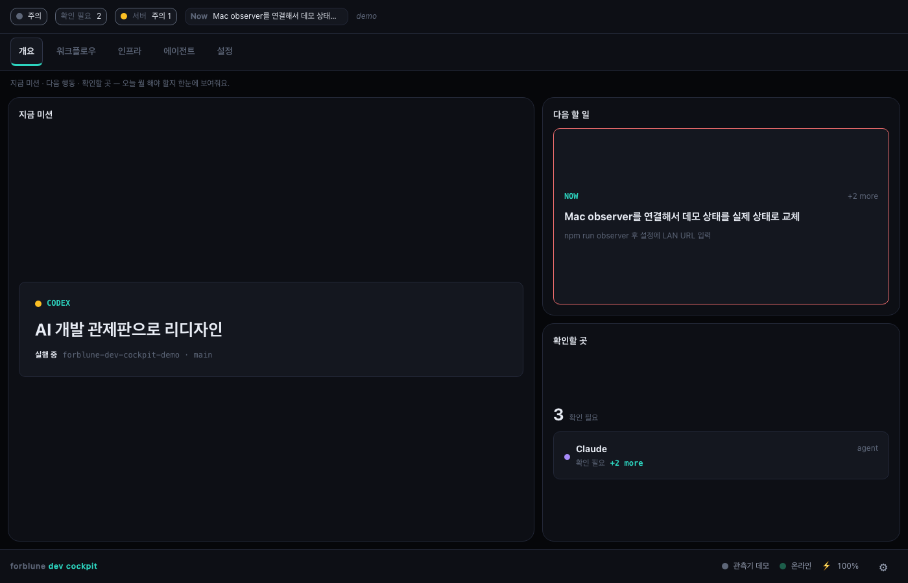

# Forblune Dev Cockpit — AI-Native Dev Command Center (Demo)

**[Live Demo →](https://forblune.github.io/forblune-dev-cockpit-demo/)**

[](https://github.com/forblune/forblune-dev-cockpit-demo/actions/workflows/deploy.yml)

**A public demo of a personal operating dashboard for AI-assisted development.**

Solo builders and AI-assisted developers juggle a lot at once — agent runs, CI,
deploy targets, env config — with no single screen that says "here's what
matters right now." This is a portfolio-safe demo of a cockpit built to solve
that for one person's own workflow: mission, next action, blockers, agents,
and infra in one glance instead of five tabs.



_The Overview tab — current mission, next action, and what needs attention. All data shown is demo data._

## What this answers

| Question | Where |
|---|---|
| What is this? | This README + the Overview tab |
| What's the current mission? | **Overview** → Current Mission |
| What should I do next? | **Overview** → Next Action |
| What's blocked or needs me? | **Overview** → Attention Radar |
| What agents/tools are active? | **Agents** → Agent Workflows, Usage |
| What's the path from idea to deploy? | **Workflow** → Idea → Spec → Build → Test → Deploy → Observe |
| Is my infrastructure healthy? | **Infra** → service status, env checks |

## Demo mode

Every widget shows a small **Demo** badge when it's rendering bundled sample
data instead of a live source — nothing here is faked as real. A widget either
shows live data with an honest freshness state (live / stale / offline) or
plainly says "demo." Settings optionally lets you point the dashboard at your
own local endpoint to replace the sample data; the demo is fully functional
without touching Settings at all.

The app uses local demo data only. It does not include private infrastructure details, real server endpoints, personal logs, API keys, or operational runbooks.

## Demo Sections

- **Overview** — current mission, next action, and what needs attention.
- **Workflow** — Idea → Spec → Build → Test → Deploy → Observe, plus a live system map.
- **Infra** — demo service status (GitHub / deploy target / database) and edge-device readiness.
- **Agents** — which AI agents are working on what, and their usage limits.
- **Settings** — every field is optional; the demo works fully without touching this tab.

## Development

```bash
npm ci
npm run dev
```

## Checks

```bash
npm run lint
npm run typecheck
npm run test
npm run build
```

## GitHub Pages

The Vite base path is configured for:

```text
/forblune-dev-cockpit-demo/
```

When deployed from GitHub Pages, the expected URL is:

```text
https://forblune.github.io/forblune-dev-cockpit-demo/
```

## Privacy

This demo intentionally avoids:

- real LAN addresses
- real device or server names
- private project names
- internal API routes
- API keys, tokens, or secrets
- personal development logs

---

Designed and built by **forblune** as a public demo of an AI-native personal dev cockpit.
